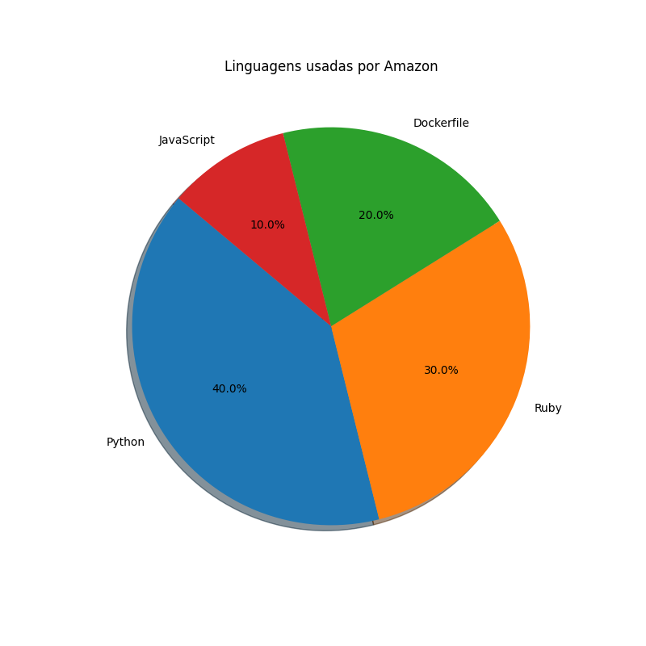
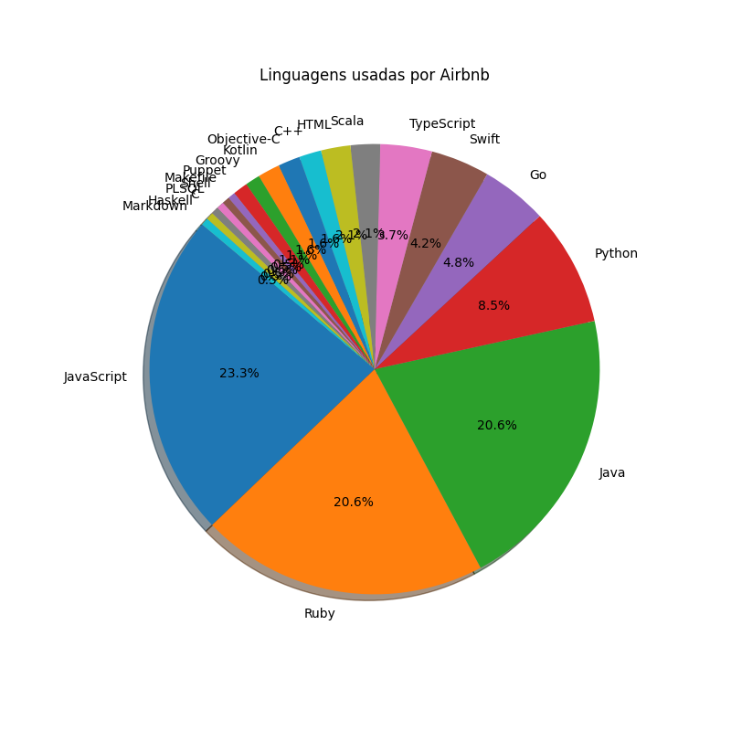
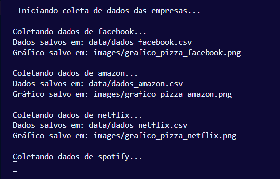

# Pipeline de Dados - Linguagens Utilizadas em Big Techs (Projeto ETL)

## Descrição

Este projeto consiste em um pipeline de dados para extração, transformação e carregamento (ETL) das linguagens mais usadas em repositórios públicos de big techs no GitHub. O objetivo é coletar dados das APIs, gerar arquivos CSV com as linguagens utilizadas, e criar gráficos de pizza utilizando matplotlib para facilitar a visualização e análise.

O pipeline é desenvolvido em Python, utilizando requisições HTTP, manipulação de dados com pandas, visualização com matplotlib, e organização orientada a objetos.

## Tecnologias

- Python 3.10+
- Requests
- Pandas
- Matplotlib
- python-dotenv
- Ambiente virtual (venv)

## Estrutura do Projeto

```
projeto_requests/
│
├── data/                      # CSVs com dados das linguagens
├── images/                    # Gráficos de pizza
├── src/                       # Código-fonte do projeto
│   ├── cria_repositorios.py   # Classe para coletar dados da API do GitHub
│   ├── dados_repo.py          # Classe para criar repositórios e enviar arquivos via API
│   ├── main.py               # Funções utilitárias, como geração de gráficos
│   └── utils.py                # Script principal que orquestra a execução
├── .env                       # Github Token
├── .gitignore                 # Arquivos e pastas ignorados pelo Git
├── requirements.txt           # Dependências do projeto
└── README.md                  # Documentação do projeto
```

## Como Rodar

1. Clone o repositório e entre na pasta do projeto.

2. Crie e ative um ambiente virtual:

   - Linux / macOS / WSL:
     ```bash
     python3 -m venv .venv
     source .venv/bin/activate
     ```

   - Windows PowerShell:
     ```powershell
     python -m venv .venv
     .venv\Scripts\Activate.ps1
     ```

3. Instale as dependências:

   ```bash
   pip install -r requirements.txt
   ```

4. Configure seu token do GitHub no arquivo `.env`:

   ```
   GITHUB_TOKEN=seu_token_aqui
   ```

5. Execute o script principal para coletar dados, gerar CSVs, criar gráficos e subir no GitHub:

   ```bash
   python src/main.py
   ```

## Visualizações

### Gráficos de Linguagens em Big Techs






### Visualização do terminal rodando o script.




## Como Contribuir

Contribuições são super bem-vindas! Sinta-se à vontade para abrir issues ou enviar pull requests com melhorias, correções ou novas funcionalidades.

## Autor

Guilherme Duffes

## Licença

MIT License
